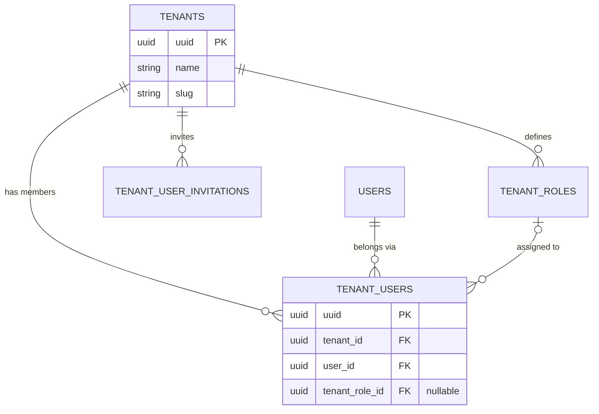
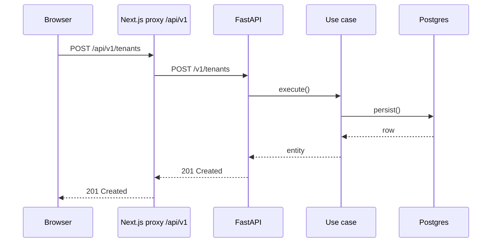
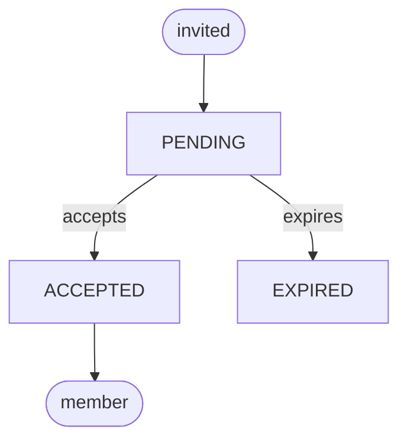

# /add-docs — Reference

Everything the [`SKILL.md`](SKILL.md) process needs but shouldn't inline. All paths
are relative to the repo root.

**Contents:** [Language](#language) · [1. Where pages go](#1-where-pages-go) ·
[2. Frontmatter](#2-frontmatter-house-convention--keep-it-minimal) ·
[3. Mermaid diagram catalog](#3-mermaid-diagram-catalog-preferred-for-anything-data-driven) ·
[4. Static & animated SVG](#4-static--animated-svg) · [5. Other media](#5-other-media) ·
[6. Verify & preview](#6-verify--preview) · [7. Full gotcha list](#7-full-gotcha-list)

---

## Language

Language rules (Spanish default, what to translate, what stays verbatim) live in
[`SKILL.md`](SKILL.md#establish-the-page). Apply them before writing.

---

## 1. Where pages go

All pages live under **`docs/content/docs/**`** (`.mdx`, or `.md` for plain
contracts). One docs collection plus the OpenAPI pages generated in memory under
`referencia/api/`. Each top folder is a root folder (`"root": true`), rendered as
a navbar tab; pick it by the reader's need (Diátaxis):

| Folder | Need | URL |
|---|---|---|
| `(empezar)/` | Tutorial: install, first tour, create a project | `/docs/<slug>` (group folder: no URL segment) |
| `guias/<area>/` | How-to: one concrete task (`backend`, `frontend`, `documentacion`, `operacion`) | `/docs/guias/<area>/<slug>` |
| `conceptos/` | Explanation: architecture, domain, data model | `/docs/conceptos/<slug>` |
| `referencia/` | Exact facts: commands, contracts; `api/` is generated | `/docs/referencia/<slug>` |
| `equipo/` | Repository contracts read by agents: profile, verification, ADRs | `/docs/equipo/<slug>` |

- **Slug** = path under `content/docs`, minus extension; `index` maps to the folder URL.
- **The sidebar is `meta.json`-driven.** Add the slug to the directory's `pages`
  (array order = sidebar order). A new subfolder needs its own `meta.json` and an
  entry in the parent's `pages` (`"...folder"` inlines it, `"---Label---"` adds a separator).
- **Never** hand-write endpoint pages: update the backend and run `openapi-sync`.
- **Links:** use file-relative paths (`../equipo/verificacion.md`, `../../../../backend/README.md`).
  A remark plugin turns content links into site URLs and other repository files
  into links to the `origin` remote; `just agent-check` fails on a broken one.

---

## 2. Frontmatter (house convention — keep it minimal)

The body must **not** restate the `# title`; Fumadocs renders `title` + `description` for you.

```yaml
---
title: Modelo de datos                       # required (string)
description: Cómo se relacionan tenants…     # required by house convention (renders as the lead)
---
```

Optional `icon:` takes a [Lucide](https://lucide.dev/icons) name shown in the sidebar.
Ordering, grouping and hiding live in `meta.json`, not in frontmatter — there is
no `sidebar:`, `tags:`, `lastUpdated:`, `difficulty:` or `method:` here.

### Body conventions (see `guias/documentacion/escribir-paginas.mdx`)
- Open with `<Callout title="En resumen">…</Callout>` — a 1–2 sentence summary.
- Use `##` and `###` for sections; never `#`.
- kebab-case ASCII filenames.

### MDX components available (wired in `docs/app/components/mdx.tsx`)
| Component | Use for |
|---|---|
| `<Callout title="…">` | The "En resumen" opener; notes and warnings (`type="warn"`) |
| `<Steps>` / `<Step>` | Ordered walkthroughs (layers, setup sequences) |
| `<Tabs>` / `<Tab>` | Alternatives (e.g. pnpm vs just, curl vs httpie) |
| `<Accordions>` / `<Accordion>` | Collapsible FAQ / detail sections |
| `<TypeTable type={{…}}>` | Option/field/prop enumerations with descriptions |
| fenced ` ```mermaid ` | All data-driven diagrams (`remarkMdxMermaid` turns them into `<Mermaid>`, rendered client-side) |

Anything else from `fumadocs-ui/mdx` defaults (`Cards`/`Card`, headings with anchors,
code blocks with copy button) works out of the box. Don't import components inside
the page — they're injected globally; the only import is `lucide-react` icons for
`<Card icon={...}>`.

---

## 3. Mermaid diagram catalog (preferred for anything data-driven)

Write a fenced block — the site renders it client-side and re-themes it automatically on
light/dark switch. **No `%%{init}%%` / no inline styling** — the theme is injected at
render time.

| Subject you're documenting | Mermaid type |
|---|---|
| Database schema / entities & FKs | `erDiagram` |
| Request / event / message flow over time | `sequenceDiagram` |
| Lifecycle, status machine, invitation states | `flowchart TD` with labeled edges — **not** `stateDiagram-v2` (see warning below) |
| Pipeline / decision branching / layering | `flowchart TB` (or `LR`) |
| Class / type / aggregate structure | `classDiagram` |
| Timeline / rollout / phases | `flowchart LR` with ordered nodes, or a table |
| Taxonomy / concept map | `flowchart TB` tree, or a table |
| Proportions (status split) | `pie` |

Use only the stable types above: `flowchart`, `erDiagram`, `sequenceDiagram`,
`classDiagram` and `pie`. Other types (`stateDiagram-v2`, `gantt`, `timeline`,
`mindmap`, …) can flake in the Vite dev server; see the lifecycle warning below.

### ER diagram skeleton (real core tables — verify columns before drawing)
````md

````
Cardinality cheat: `||--||` one-to-one · `||--o{` one-to-many · `|o--o{` optional
parent (nullable FK) to many · `}o--o{` many-to-many. Check `nullable=` on each FK:
`tenant_users.tenant_role_id` is nullable (`ondelete="SET NULL"`), so the role side
is `|o`. Primary keys are the `uuid` column from the shared mixins, not `id`.
Table names come from `__tablename__` in `backend/src/common/database/models/**` — use them verbatim.

### Sequence diagram skeleton
````md

````
Browser clients use base URL `/api` (`frontend/src/shared/http/client.ts`) and
call `/v1/...`; `frontend/src/proxy.ts` forwards `/api/v1/*` to the backend's
`/v1/*` routers. Dedicated BFF route handlers under `frontend/src/app/api/**`
exist only for specific flows (for example `auth/*`); check which path the flow
you document actually takes.

### State machine / lifecycle skeleton — use `flowchart`, not `stateDiagram-v2`
> **⚠️ Prefer `flowchart` for lifecycles on this site.** Mermaid lazy-loads a *separate
> module per diagram type*; less-common modules (like `stateDiagram-v2`) can intermittently
> fail in the Vite **dev** server (`Failed to fetch dynamically imported module …/.vite/deps/…`,
> an optimize-deps race — it bundles fine in the production build). `flowchart`, `erDiagram`,
> `sequenceDiagram` are battle-tested. Model state machines as a `flowchart` with labeled
> edges — rounded `([…])` nodes for the start/end, plain nodes for the states:
````md

````
States come from `TenantUserInvitationStatus` in
`backend/src/common/domain/enums/tenants.py`. The enum also declares `REVOKED`,
but no current code path sets it; draw only transitions you find in the
invitation use cases and repositories.

---

## 4. Static & animated SVG

Put the file in `docs/public/diagrams/<name>.svg`; embed with ``.
It is served as an ``, so:
- ✅ SMIL animation (`<animate>`, `<animateMotion>`, `<animateTransform>`) runs.
- ✅ Inline `<style>` with `@keyframes` runs.
- ❌ `<script>` inside the SVG does **not** run. No JS, no hover/click handlers.

**Palette** (match the site — teal primary on cool-gray, see `docs/app/app.css`):
`#0d9488` teal-600 (primary stroke) · `#2dd4bf` teal-400 · `#ccfbf1` teal-100 (fill) ·
`#f0fdfa` teal-50 (bg-fill) · `#f8fafc` slate-50 (canvas) · `#0f172a` slate-900 (text) ·
`#475569` slate-600 (muted) · `#cbd5e1` slate-300 (hairline). Font: the site's
`--font-sans` stack, `Figtree, Geist, ui-sans-serif, system-ui, sans-serif`. An
SVG served as `` cannot load the site's web fonts, so it falls back to the
system stack unless the font is installed locally. Rounded corners `rx="6"`.

### When to animate
Only when **motion explains something** a static picture can't: data flowing through a
pipeline, a state transition, a request fanning out. A static SVG (or Mermaid) is better
for structure. Keep loops calm (`dur` 3–6s, `repeatCount="indefinite"`), never seizure-fast.

### Minimal SMIL recipes
A dot traveling a path:
```xml
<circle r="7" fill="#0d9488">
  <animateMotion dur="4s" repeatCount="indefinite" path="M60,90 L620,90"/>
</circle>
```
A node pulsing (staggered with `begin`):
```xml
<rect x="40" y="60" width="120" height="40" rx="6" fill="#ccfbf1" stroke="#0d9488">
  <animate attributeName="fill-opacity" values="0.3;1;0.3" dur="4s"
           begin="0s" repeatCount="indefinite"/>
</rect>
```
A CSS-keyframe alternative (also valid via ``):
```xml
<style>
  @keyframes pulse { 0%,100% { opacity: .35 } 50% { opacity: 1 } }
  .node { animation: pulse 4s ease-in-out infinite; }
</style>
```
See [`templates/animated-pipeline.svg`](templates/animated-pipeline.svg) for a complete,
working file (a token traveling through five pulsing phase nodes) you can copy and relabel.

---

## 5. Other media

- **Images / screenshots** → `docs/public/<area>/<name>.png`, embed ``.
- **Code** → fenced blocks with a language (` ```python `, ` ```ts `); the site highlights
  them and adds a copy button.
- **Callouts** → `<Callout title="…">` (default info) or `<Callout type="warn" title="…">`.
  Keep them short.
- **Tables** → standard GFM tables render cleanly. Prefer a table over a bulleted list for
  any enumeration with ≥2 attributes per row; prefer `<TypeTable>` when rows are
  name + type + description.

---

## 6. Verify & preview

```bash
just docs build              # the gate: MDX compile + prerender of every /docs/* route
# equivalent: pnpm --prefix docs build   (or: cd docs && pnpm build)
just docs typecheck          # optional: react-router typegen + tsc --noEmit
```
Preview a single diagram in isolation (no dev server needed). The skill dir is
`.claude/skills/add-docs` or `.agents/skills/add-docs` depending on the runtime you're in:
```bash
node <this-skill-dir>/tools/preview-diagram.mjs docs/content/docs/<subfolder>/<slug>.mdx
# → writes /tmp/add-docs-preview.html by default; pass --out <path.html> to choose
#   another file (use a scratch directory outside the repo). Needs network: the
#   page loads Mermaid from a CDN. --help prints usage.
```

---

## 7. Full gotcha list
- Fumadocs auto-prints `title` (h1) + `description` (lead). **Never** start the body with `# ...`.
- **`meta.json` is mandatory bookkeeping** — a page absent from its directory's `pages`
  array won't appear in the sidebar; a new folder needs its own `meta.json` plus an entry
  in the parent's `pages`.
- **MDX parses JSX.** Bare `<` / `{` in prose breaks the compile — backtick or escape them.
- Animated SVG embedded as `` ignores `<script>`. SMIL + CSS keyframes only.
- **Exotic Mermaid types can flake in the Vite dev server** (`Failed to fetch dynamically
  imported module …/.vite/deps/…`). Model state machines as a `flowchart` instead — see
  "State machine / lifecycle skeleton" above. Stick to the stable types in the catalog:
  `flowchart`, `erDiagram`, `sequenceDiagram`, `classDiagram`, `pie`.
- Don't add `%%{init}%%` or inline colors to Mermaid — the site theme (and its dark-mode
  re-render) overrides and clashes.
- The build **prerenders every docs route** (`docs/react-router.config.ts`), so `just docs build`
  catches broken pages for real — a new `.mdx` file is added to the prerender list automatically.
- Frontmatter is `title` + `description` (+ optional `icon`). Don't invent `sidebar:`,
  `tags:`, `difficulty:` … keys from other sites' schemas.
- The site has no login; privacy, if needed, belongs to the hosting layer. For quick
  diagram checks use `tools/preview-diagram.mjs`.
- Keep one page = one subject. If the request spans several subjects, write several pages
  (or ask which to do first).
- **Language:** follow the rules in [`SKILL.md`](SKILL.md#establish-the-page); translate
  diagram labels, never Mermaid keywords, enum values, identifiers or paths.
