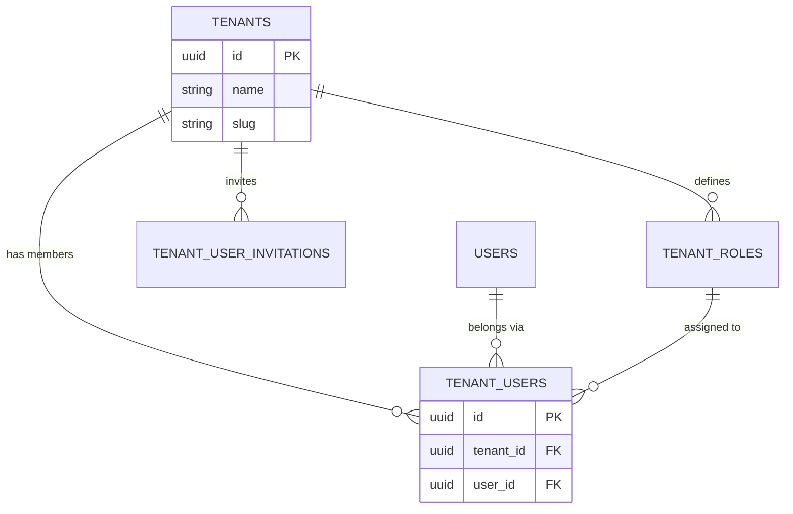
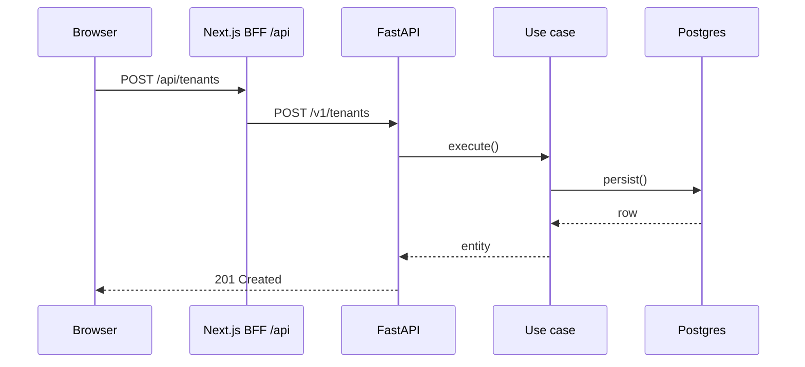
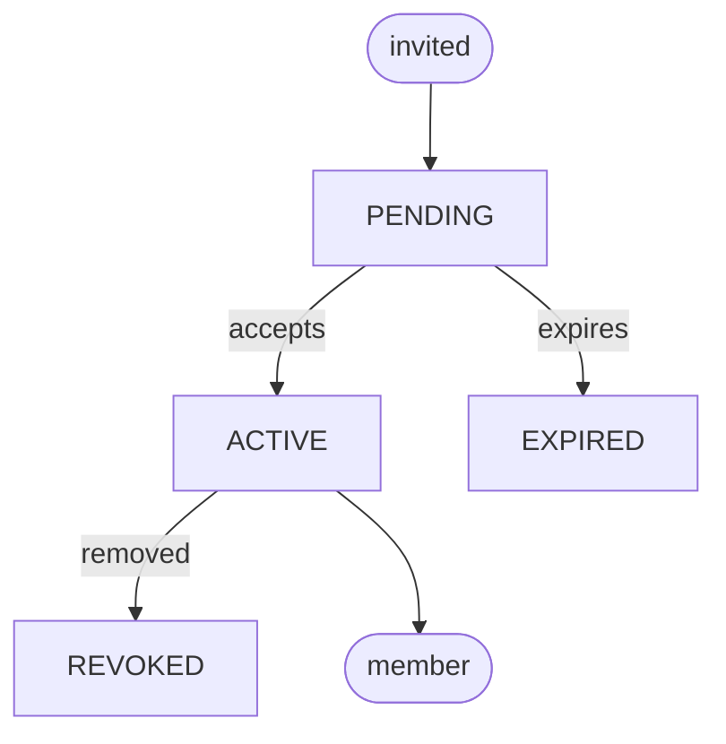

# /add-docs — Reference

Everything the [`SKILL.md`](SKILL.md) process needs but shouldn't inline. All paths
are relative to the repo root.

---

## Language

Decide this **before writing** (it's step 1 of the process).

- **Default: Spanish** — the existing content under `docs/content/docs/**` is Spanish.
  If the request doesn't make the language explicit, **ask** with `AskUserQuestion` —
  options *Español* (recommended, first) and *English* — and wait for the answer. If the
  request names a language ("documenta … en inglés", "in English"), honor it without asking.
  When you also need the placement question, ask both in one `AskUserQuestion` call.
- **Translate (everything a reader sees):** frontmatter `title` and `description`; all headings;
  prose; table headers and cell text; callouts; "where to go next" link labels; and **diagram
  labels** — Mermaid node/edge text *and* the `<text>` in any SVG you author.
- **Keep verbatim (never translate), in any language:**
  - Code identifiers, function/class names, `__tablename__`s and column names, file paths.
  - **Enum values** and other wire/string constants — `ACTIVE`, `PENDING`, `OWNER`, …
  - **Mermaid keywords** and syntax — `erDiagram`, `flowchart TB`, `sequenceDiagram`,
    cardinality (`||--o{`), `PK`/`FK`.
  - URLs, slugs, and **frontmatter keys** — these are schema, not prose.
- **Slugs/filenames stay ASCII kebab-case even for Spanish pages** — `data-model.mdx`, not
  `modelo-de-datos-ñ.mdx`. Keep accents and ñ out of paths/URLs; they belong in the visible text.
- **One page, one language.** Don't mix languages within a page. Match the language of the
  pages you link to when possible — only the link *label* is yours to translate.

---

## 1. Where pages go

All rendered pages live under **`docs/content/docs/**`** as `.mdx` files
(one Fumadocs content source — there are no other collections).

| Subfolder | For | URL |
|---|---|---|
| `conceptos/` | Core concepts: tenancy, auth, members, roles | `/docs/conceptos/<slug>` |
| `arquitectura/` | Backend/frontend/docs architecture, "how it works" | `/docs/arquitectura/<slug>` |
| `operacion/` | Running, deploying, operating the stack | `/docs/operacion/<slug>` |

- **Slug** = path under `content/docs`, minus extension. `content/docs/arquitectura/data-model.mdx`
  → URL `/docs/arquitectura/data-model`. An `index.mdx` maps to the folder URL.
- **The sidebar is `meta.json`-driven.** Each directory has a `meta.json`:
  ```json
  { "title": "Arquitectura", "pages": ["index", "data-model"] }
  ```
  Add your new page's slug to its directory's `pages` (order in the array = sidebar order).
  A new subfolder needs its own `meta.json` AND an entry in the parent's `pages`.
- **Never** put rendered pages in `docs/internal/**` — that tree is project-internal and not
  loaded by the content source. (It's a good place to *read* existing ERD/architecture notes
  while researching, though.)

---

## 2. Frontmatter (house convention — keep it minimal)

The body must **not** restate the `# title`; Fumadocs renders `title` + `description` for you.

```yaml
---
title: Modelo de datos                       # required (string)
description: Cómo se relacionan tenants…     # required by house convention (renders as the lead)
---
```

That's the whole schema in use on this site. Ordering, grouping and hiding live in
`meta.json`, not in frontmatter — there is no `sidebar:`, `tags:`, `lastUpdated:`,
`difficulty:` or `method:` here.

### Body conventions (see `docs/README.md`)
- Open with `<Callout title="En resumen">…</Callout>` — a 1–2 sentence summary.
- Use `##` and `###` for sections; never `#`.
- kebab-case ASCII filenames.

### MDX components available (wired in `docs/app/components/mdx.tsx`)
| Component | Use for |
|---|---|
| `<Callout title="…">` | The "En resumen" opener; notes and warnings (`type="warn"`) |
| `<Steps>` / `<Step>` | Ordered walkthroughs (layers, setup sequences) |
| `<Tabs>` / `<Tab>` | Alternatives (e.g. pnpm vs just, curl vs httpie) |
| `<Accordions>` / `<Accordion>` | Collapsible FAQ / detail sections |
| `<TypeTable type={{…}}>` | Option/field/prop enumerations with descriptions |
| fenced ` ```mermaid ` | All data-driven diagrams (rendered client-side) |

Anything else from `fumadocs-ui/mdx` defaults (headings with anchors, code blocks with
copy button) works out of the box. Don't import components inside the page — they're
injected globally.

---

## 3. Mermaid diagram catalog (preferred for anything data-driven)

Write a fenced block — the site renders it client-side and re-themes it automatically on
light/dark switch. **No `%%{init}%%` / no inline styling** — the theme is injected at
render time.

| Subject you're documenting | Mermaid type |
|---|---|
| Database schema / entities & FKs | `erDiagram` |
| Request / event / message flow over time | `sequenceDiagram` |
| Lifecycle, status machine, invitation states | `flowchart TD` with labeled edges — **not** `stateDiagram-v2` (see warning below) |
| Pipeline / decision branching / layering | `flowchart TB` (or `LR`) |
| Class / type / aggregate structure | `classDiagram` |
| Timeline / rollout / phases | `gantt` or `timeline` |
| Taxonomy / concept map | `mindmap` |
| Proportions (status split) | `pie` |

### ER diagram skeleton (real core tables — verify columns before drawing)
````md

````
Cardinality cheat: `||--||` one-to-one · `||--o{` one-to-many · `}o--o{` many-to-many.
Table names come from `__tablename__` in `backend/src/common/database/models/**` — use them verbatim.

### Sequence diagram skeleton
````md

````

### State machine / lifecycle skeleton — use `flowchart`, not `stateDiagram-v2`
> **⚠️ Prefer `flowchart` for lifecycles on this site.** Mermaid lazy-loads a *separate
> module per diagram type*; less-common modules (like `stateDiagram-v2`) can intermittently
> fail in the Vite **dev** server (`Failed to fetch dynamically imported module …/.vite/deps/…`,
> an optimize-deps race — it bundles fine in the production build). `flowchart`, `erDiagram`,
> `sequenceDiagram` are battle-tested. Model state machines as a `flowchart` with labeled
> edges — rounded `([…])` nodes for the start/end, plain nodes for the states:
````md

````

---

## 4. Static & animated SVG

Put the file in `docs/public/diagrams/<name>.svg`; embed with ``.
It is served as an ``, so:
- ✅ SMIL animation (`<animate>`, `<animateMotion>`, `<animateTransform>`) runs.
- ✅ Inline `<style>` with `@keyframes` runs.
- ❌ `<script>` inside the SVG does **not** run. No JS, no hover/click handlers.

**Palette** (match the site — teal primary on cool-gray, see `docs/app/app.css`):
`#0d9488` teal-600 (primary stroke) · `#2dd4bf` teal-400 · `#ccfbf1` teal-100 (fill) ·
`#f0fdfa` teal-50 (bg-fill) · `#f8fafc` slate-50 (canvas) · `#0f172a` slate-900 (text) ·
`#475569` slate-600 (muted) · `#cbd5e1` slate-300 (hairline). Font:
`ui-sans-serif, system-ui, sans-serif`. Rounded corners `rx="6"`.

### When to animate
Only when **motion explains something** a static picture can't: data flowing through a
pipeline, a state transition, a request fanning out. A static SVG (or Mermaid) is better
for structure. Keep loops calm (`dur` 3–6s, `repeatCount="indefinite"`), never seizure-fast.

### Minimal SMIL recipes
A dot traveling a path:
```xml
<circle r="7" fill="#0d9488">
  <animateMotion dur="4s" repeatCount="indefinite" path="M60,90 L620,90"/>
</circle>
```
A node pulsing (staggered with `begin`):
```xml
<rect x="40" y="60" width="120" height="40" rx="6" fill="#ccfbf1" stroke="#0d9488">
  <animate attributeName="fill-opacity" values="0.3;1;0.3" dur="4s"
           begin="0s" repeatCount="indefinite"/>
</rect>
```
A CSS-keyframe alternative (also valid via ``):
```xml
<style>
  @keyframes pulse { 0%,100% { opacity: .35 } 50% { opacity: 1 } }
  .node { animation: pulse 4s ease-in-out infinite; }
</style>
```
See [`templates/animated-pipeline.svg`](templates/animated-pipeline.svg) for a complete,
working file (a token traveling through five pulsing phase nodes) you can copy and relabel.

---

## 5. Other media

- **Images / screenshots** → `docs/public/<area>/<name>.png`, embed ``.
- **Code** → fenced blocks with a language (` ```python `, ` ```ts `); the site highlights
  them and adds a copy button.
- **Callouts** → `<Callout title="…">` (default info) or `<Callout type="warn" title="…">`.
  Keep them short.
- **Tables** → standard GFM tables render cleanly. Prefer a table over a bulleted list for
  any enumeration with ≥2 attributes per row; prefer `<TypeTable>` when rows are
  name + type + description.

---

## 6. Verify & preview

```bash
just docs build              # the gate: MDX compile + prerender of every /docs/* route
# equivalent: pnpm --prefix docs build   (or: cd docs && pnpm build)
just docs typecheck          # optional: react-router typegen + tsc --noEmit
```
Preview a single diagram in isolation (no dev server needed). The skill dir is
`.claude/`, `.codex/` or `.opencode/skills/add-docs` depending on the runtime you're in:
```bash
node <this-skill-dir>/tools/preview-diagram.mjs docs/content/docs/<subfolder>/<slug>.mdx
# → writes /tmp/add-docs-preview.html ; open or screenshot it
```

---

## 7. Full gotcha list
- Fumadocs auto-prints `title` (h1) + `description` (lead). **Never** start the body with `# ...`.
- **`meta.json` is mandatory bookkeeping** — a page absent from its directory's `pages`
  array won't appear in the sidebar; a new folder needs its own `meta.json` plus an entry
  in the parent's `pages`.
- **MDX parses JSX.** Bare `<` / `{` in prose breaks the compile — backtick or escape them.
- Animated SVG embedded as `` ignores `<script>`. SMIL + CSS keyframes only.
- **Exotic Mermaid types can flake in the Vite dev server** (`Failed to fetch dynamically
  imported module …/.vite/deps/…`). Model state machines as a `flowchart` instead — see
  "State machine / lifecycle skeleton" above. Stick to `flowchart`, `erDiagram`,
  `sequenceDiagram`, `classDiagram`, `pie`.
- Don't add `%%{init}%%` or inline colors to Mermaid — the site theme (and its dark-mode
  re-render) overrides and clashes.
- The build **prerenders every docs route** (`docs/react-router.config.ts`), so `just docs build`
  catches broken pages for real — a new `.mdx` file is added to the prerender list automatically.
- Frontmatter is `title` + `description` only. Don't invent `sidebar:`, `tags:`,
  `difficulty:` … keys from other sites' schemas.
- Auth is optional and client-side (`VITE_DOCS_REQUIRE_AUTH`, default false) — `just docs dev`
  serves pages without login in the default setup; for quick diagram checks use
  `tools/preview-diagram.mjs`.
- Keep one page = one subject. If the request spans several subjects, write several pages
  (or ask which to do first).
- **Language is a content decision, not a code one.** Translate diagram labels too — but never
  translate Mermaid keywords, enum values, identifiers or paths, and keep slugs/filenames ASCII
  (no accents). Default Spanish; ask when unspecified.
