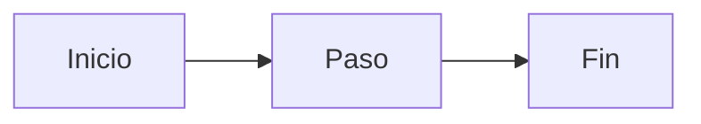

{/*
  DO NOT write a `# H1` here — Fumadocs renders `title` + `description`.
  Open with the <Callout>, then lead with a diagram.
  Replace every <placeholder>. Delete sections you don't need.
  Remember: add this page's slug to the directory's meta.json `pages` array.
*/}

<Callout title="En resumen">
  <Dos frases que resumen la página: qué explica y por qué le importa al lector.>
</Callout>

## Vista general

Una frase interpretando el diagrama — señala la parte que más importa.

## <Sección de detalle>

Prosa + un visual enfocado o una tabla. Prefiere una tabla para enumeraciones:

| Cosa | Qué hace | Dónde |
|---|---|---|
| <x> | <y> | `path/to/file.py` |

## <Ciclo de vida / flujo con movimiento>

Cuando una transición o flujo se entiende mejor *viéndolo moverse*, usa un SVG animado:

## Siguientes pasos

- [<Página relacionada>](/docs/<subfolder>/<slug>)
- [<Otra página>](/docs/<subfolder>/<slug>)
