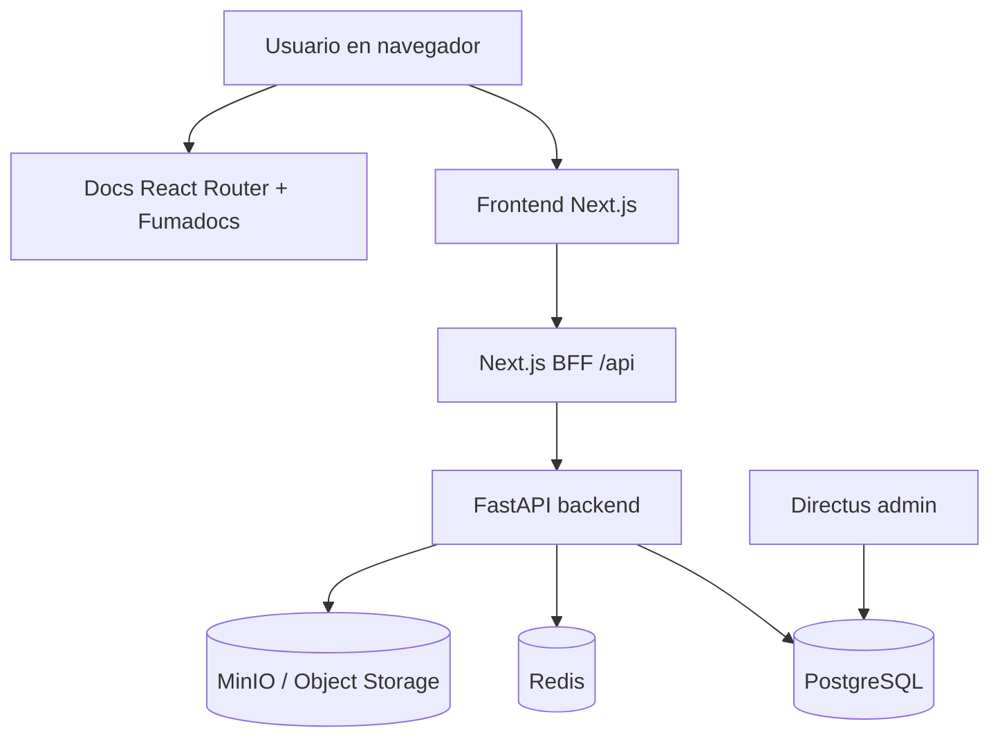
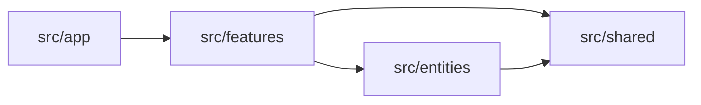

<Callout title="En resumen">
  El sistema separa backend FastAPI con Clean Architecture, frontend Next.js con BFF same-origin, una app de documentación aislada en React Router/Fumadocs y Directus como consola interna.
</Callout>

## Vista de alto nivel

## Backend

El backend usa Clean Architecture con módulos orientados a dominio:

<Steps>
  <Step>
    ### Domain
    Entidades, value objects, errores de dominio y contratos de repositorio.
  </Step>
  <Step>
    ### Application
    Casos de uso como dataclasses con `execute()`, CQRS ligero y orquestación.
  </Step>
  <Step>
    ### Infrastructure
    SQLAlchemy async, storage adapters, integraciones externas y persistencia.
  </Step>
  <Step>
    ### Presentation
    Routers FastAPI, presenters y conversión a respuestas `camelCase`.
  </Step>
</Steps>

## Frontend

El frontend principal vive en `frontend/` y sigue la arquitectura feature-first descrita en `docs/internal/architecture/frontend-architecture.md`:

La regla de integración es que el browser no llama al backend directamente desde la app principal; usa rutas BFF same-origin bajo `/api/...`.

## Documentación

Esta app de documentación está aislada en `docs/`:

<TypeTable
  type={{
    runtime: {
      description: "React Router Framework Mode sobre Vite.",
      type: "docs app",
    },
    content: {
      description: "Fumadocs MDX en `docs/content/docs` con sidebar por `meta.json`.",
      type: "content source",
    },
    search: {
      description: "Índice Orama estático generado en `/api/search`.",
      type: "static resource route",
    },
    llms: {
      description: "Rutas `llms.txt`, `llms-full.txt` y `llms.mdx/docs/*`.",
      type: "AI-readable docs",
    },
  }}
/>
