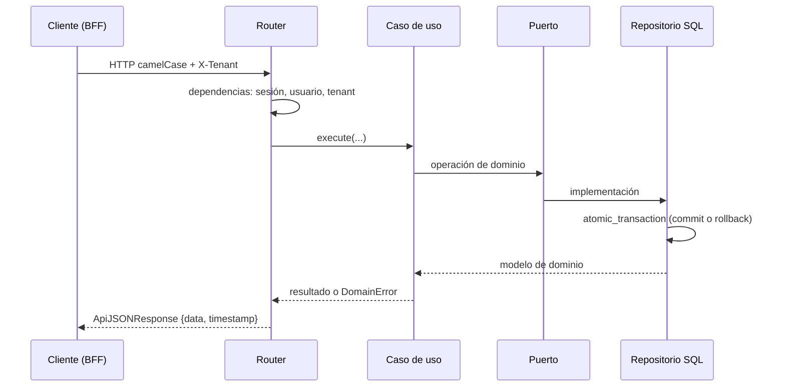

<Callout title="En resumen">
  Clean Architecture con DDD: `presentation → infrastructure → application → domain`, sin imports hacia la izquierda. Cada módulo usa solo las capas que necesita y los modelos ORM viven centralizados en `common`.
</Callout>

Las rutas son relativas a `backend/`. Los contratos de import-linter en `pyproject.toml` son la versión ejecutable de esta página; `just backend check` los aplica.

## Capas

<Steps>
  <Step>
    ### Domain

    Modelos, value objects, errores (`DomainError`) y puertos de repositorio. Solo depende de la stdlib, Pydantic y otro código de dominio.
  </Step>
  <Step>
    ### Application

    Casos de uso como dataclasses con `UseCase.execute()`, una operación por archivo, y handlers de comandos y queries del bus. No importa SQLAlchemy ni FastAPI.
  </Step>
  <Step>
    ### Infrastructure

    Repositorios SQL, builders ORM → dominio, Valkey, RabbitMQ, S3, SMTP y el cableado del bus.
  </Step>
  <Step>
    ### Presentation

    Endpoints, presenters y `router.py` con `add_api_route()`.
  </Step>
</Steps>

## Formas de módulo

| Forma | Módulos | Contenido |
| --- | --- | --- |
| Completa | `auth`, `tenants`, `users` | Puertos, casos de uso, handlers del bus, repositorios SQL, wiring y presentación |
| Delgada | `profile`, `admin`, `assets`, `messaging` | Solo las capas que su caso necesita |
| Shared kernel | `common` | Tipos de dominio compartidos, modelos ORM, contratos del bus, contextos, builders, respuestas y middlewares |

Un concepto pasa a `src/common/` cuando lo necesita un segundo módulo. Los modelos ORM siempre están en `src/common/database/models/` y las migraciones en `src/common/database/versions/`.

## Flujo de una request

- **Sesión y transacciones.** Cada request abre una sesión, pero no hay transacción de alcance request: cada escritura de repositorio confirma o revierte dentro de `atomic_transaction`. Dos escrituras no son atómicas entre sí.
- **Errores.** `DomainError` lleva código, mensaje y status HTTP; los manejadores globales lo traducen a `{errors, validation?}`.
- **Casing.** Un middleware convierte el cuerpo entrante a snake_case y las respuestas salen en camelCase. `RawJson` preserva datos opacos sin convertir.
- **Paginación.** Existe una paginación por cursor (`Page`), pero no todos los endpoints paginan: no la asumas.

## Inyección de dependencias

Explícita. `DomainContext` agrupa repositorios para CRUD local y `BusContext` resuelve comandos y queries entre módulos. No hay contenedor de DI.

## Valkey y RabbitMQ

- **Valkey** (protocolo Redis; servicio `redis` y variables `REDIS_*`) guarda la lista de permitidos de sesiones de refresh token (`{ns}_RT:{sub}:{sid}` con el jti vigente e índice `{ns}_SESS:{sub}`), la ventana de gracia de rotación, los tokens de un solo uso del reseteo de contraseña y los contadores de rate limit. La configuración local ([valkey.conf](../../../../backend/docker/valkey/valkey.conf)) prioriza la latencia: I/O threads, liberación diferida, desfragmentación activa y AOF con `appendfsync everysec` sin snapshots RDB. La política de memoria es `allkeys-lru`: la lista de permitidos falla cerrada, así que expulsar o perder una clave solo obliga a volver a iniciar sesión (o reinicia una ventana de rate limit), nunca revalida un token revocado. El AOF evita que un reinicio cierre todas las sesiones; la seguridad no depende de él. Cada proceso usa un único cliente con pool acotado (`REDIS_MAX_CONNECTIONS`, timeouts y `REDIS_HEALTH_CHECK_INTERVAL`).
- **RabbitMQ** transporta los comandos despachados con `run_async=True`. La API publica mensajes persistentes con confirmación del broker (`publisher confirms`, `mandatory`): si el broker no confirma, el request falla en lugar de perder el comando. El worker (`python -m config.worker`) consume con ack manual y `prefetch` (`RABBITMQ_PREFETCH`, por defecto 10), ejecuta cada comando en su propia sesión y confirma solo tras el éxito.
- **Reintentos y dead letters.** Un fallo, excepción o timeout (15 minutos) se reencola con pausa exponencial hasta la entrega número `RABBITMQ_DELIVERY_LIMIT` (5); esa va a `<cola>.dlq`. Un cuerpo malformado o un comando no registrado va directo a la DLQ. La cola es quorum con `x-delivery-limit` como red del broker para consumidores que caen a mitad de mensaje. La entrega es *al menos una vez*: los handlers deben poder repetirse.
- **Estabilidad del broker.** [rabbitmq.conf](../../../../backend/docker/rabbitmq/rabbitmq.conf) fija colas quorum por defecto, marcas de memoria y disco, heartbeat de 30 s y `consumer_timeout` de 30 minutos. SIGTERM detiene el consumo y espera los mensajes en curso (`RABBITMQ_SHUTDOWN_GRACE_SECONDS`).
- **Producción.** Los compose de despliegue no incluyen Valkey ni RabbitMQ: se aprovisionan fuera y deben replicar estos archivos de configuración.

## Más detalle

- Guía práctica: [Crear un módulo backend](../guias/backend/nuevo-modulo.mdx).
- Ubicación de cada artefacto y tipos base: [layers.md](../../../../.claude/skills/backend-architecture/references/layers.md).
- Contratos activos y deuda conocida: [perfil del proyecto](../equipo/perfil-del-proyecto.md).
- Endpoints: [referencia de la API](../referencia/index.mdx).
