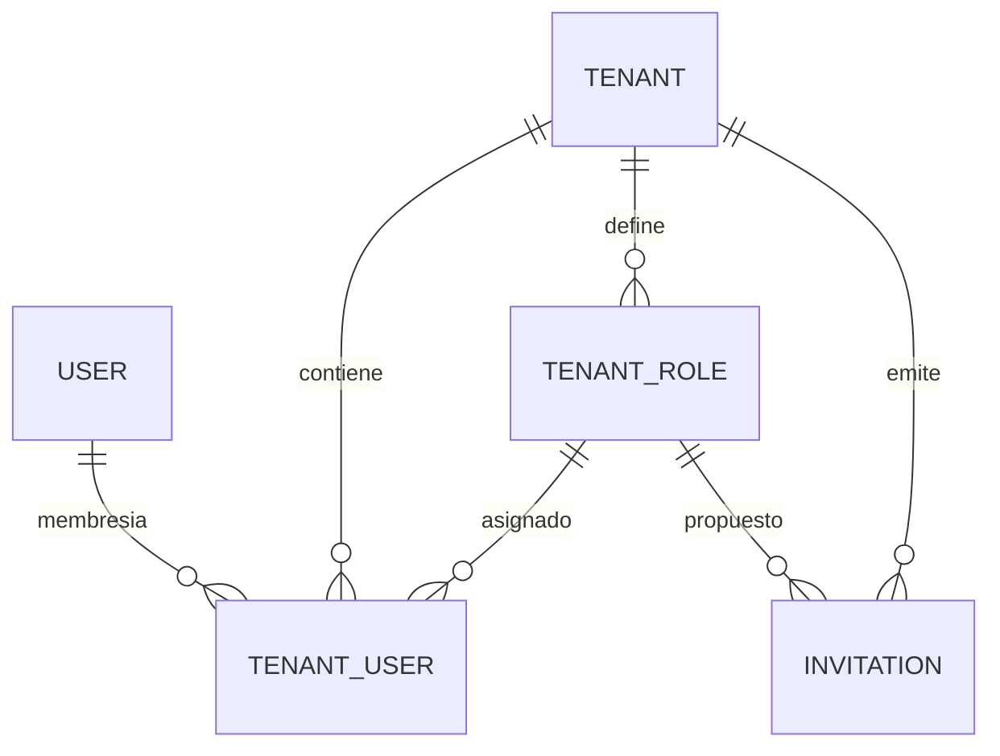

<Callout title="En resumen">
  Un usuario es una identidad global; opera dentro de un tenant a través de su membresía (`tenant user`), que tiene un rol y permisos directos. Los nuevos miembros entran por invitación.
</Callout>

## Glosario

<TypeTable
  type={{
    tenant: {
      description: "Cuenta u organización aislada: settings, avatar, roles y miembros propios.",
      type: "TenantStatus",
    },
    user: {
      description: "Identidad global; puede pertenecer a varios tenants y recuerda el actual.",
      type: "users",
    },
    "tenant user": {
      description: "Membresía de un usuario en un tenant: estado, rol, permisos directos y perfil operativo. Puede ser owner o support.",
      type: "TenantUserStatus",
    },
    invitation: {
      description: "Invitación por email con token y caducidad; al aceptarla se crea o activa la membresía.",
      type: "TenantUserInvitationStatus",
    },
    role: {
      description: "Rol del tenant con una lista de permisos (strings) que se asigna a miembros.",
      type: "TenantRoleStatus",
    },
    permission: {
      description: "String con namespace, por ejemplo tenant_users.view. El efectivo de un miembro une los de su rol y los directos.",
      type: "string",
    },
  }}
/>

## Relaciones

Los permisos no son una tabla: son listas JSON en el rol y en la membresía. El [modelo de datos](modelo-de-datos.md) muestra las columnas.

## Permisos efectivos

- Un miembro que no está `ACTIVE` no pasa ningún chequeo.
- El **owner** del tenant tiene todos los permisos.
- Un miembro con rol obtiene la unión de los permisos del rol y los directos.
- Un miembro sin rol solo tiene sus permisos directos.

Los endpoints comprueban permisos con `check_tenant_permission`. Hoy `PERMISSIONS_ENABLED = False` en `backend/src/common/constants.py`, así que esos chequeos no bloquean; se escriben igual para que activarlo no requiera cambiar endpoints. La UI oculta acciones según permisos, pero la autorización real está en el servidor. Detalle en el [perfil del proyecto](../equipo/perfil-del-proyecto.md).

## Estados

<Tabs items={["Miembro", "Invitación", "Tenant", "Rol"]}>
  <Tab value="Miembro">
    `PENDING`, `ACTIVE` e `INACTIVE`. Solo un miembro `ACTIVE` opera en el tenant.
  </Tab>
  <Tab value="Invitación">
    `PENDING` hasta que se acepta (`ACCEPTED`) o se cancela, que hoy la marca como `EXPIRED`. `REVOKED` existe en el enum pero ningún flujo lo usa.
  </Tab>
  <Tab value="Tenant">
    `ACTIVE`, `PENDING`, `INACTIVE` y `SUSPENDED`; el borrado es lógico.
  </Tab>
  <Tab value="Rol">
    `ACTIVE` e `INACTIVE`.
  </Tab>
</Tabs>

## Reglas de lenguaje

- En código y API se usan los términos `tenant`, `tenant user`, `role` y `permission`. Los textos visibles salen de los catálogos de i18n (`frontend/src/i18n/messages/`).
- Las respuestas HTTP usan camelCase; los modelos Python, snake_case.
- El superusuario administra onboarding interno fuera del flujo normal de un tenant.
