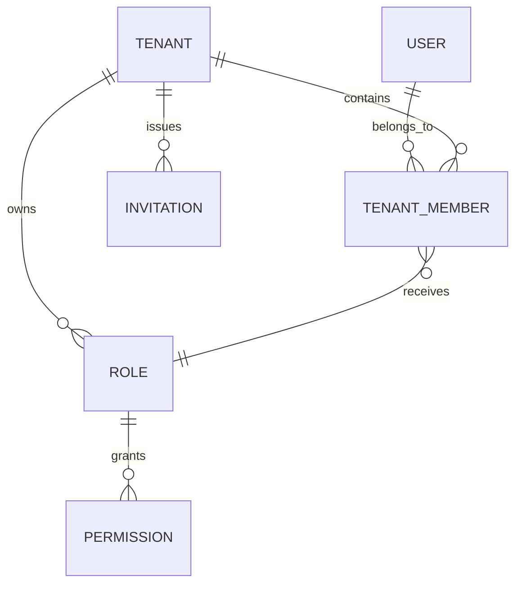

<Callout title="En resumen">
  El dominio gira alrededor de usuarios que operan dentro de tenants, con permisos expresados mediante roles y flujos de invitación, perfil, settings y assets como piezas reutilizables.
</Callout>

## Glosario

<TypeTable
  type={{
    tenant: {
      description: "Cuenta u organización aislada donde operan usuarios, settings y permisos.",
      type: "aggregate boundary",
    },
    user: {
      description: "Identidad global que puede pertenecer a uno o varios tenants.",
      type: "identity",
    },
    member: {
      description: "Relación entre usuario y tenant, con estado, rol y perfil operativo.",
      type: "tenant user",
    },
    invitation: {
      description: "Flujo para incorporar usuarios a un tenant sin crear acoplamiento manual.",
      type: "workflow",
    },
    role: {
      description: "Conjunto nombrado de permisos asignable a miembros de un tenant.",
      type: "authorization policy",
    },
    permission: {
      description: "Capacidad granular para ejecutar una acción o ver una superficie.",
      type: "capability",
    },
  }}
/>

## Relaciones principales

## Reglas de lenguaje

<Tabs items={["Dominio", "API", "UI"]}>
  <Tab value="Dominio">
    Usa `tenant`, `member`, `role` y `permission` para describir reglas de negocio. Evita mezclar estos términos con detalles de transporte HTTP.
  </Tab>
  <Tab value="API">
    Las respuestas públicas usan `camelCase`; las entidades internas de Python conservan `snake_case`.
  </Tab>
  <Tab value="UI">
    El contexto tenant y los estados de permisos deben ser visibles para reducir ambigüedad operativa.
  </Tab>
</Tabs>

## Estados frecuentes

<Accordions type="single">
  <Accordion title="Miembro invitado">
    Existe una invitación pendiente, pero todavía no hay una sesión activa aceptada para ese tenant.
  </Accordion>
  <Accordion title="Miembro activo">
    El usuario pertenece al tenant y opera con el rol asignado.
  </Accordion>
  <Accordion title="Superuser">
    Usuario con controles internos de administración fuera del flujo normal de tenant.
  </Accordion>
</Accordions>
