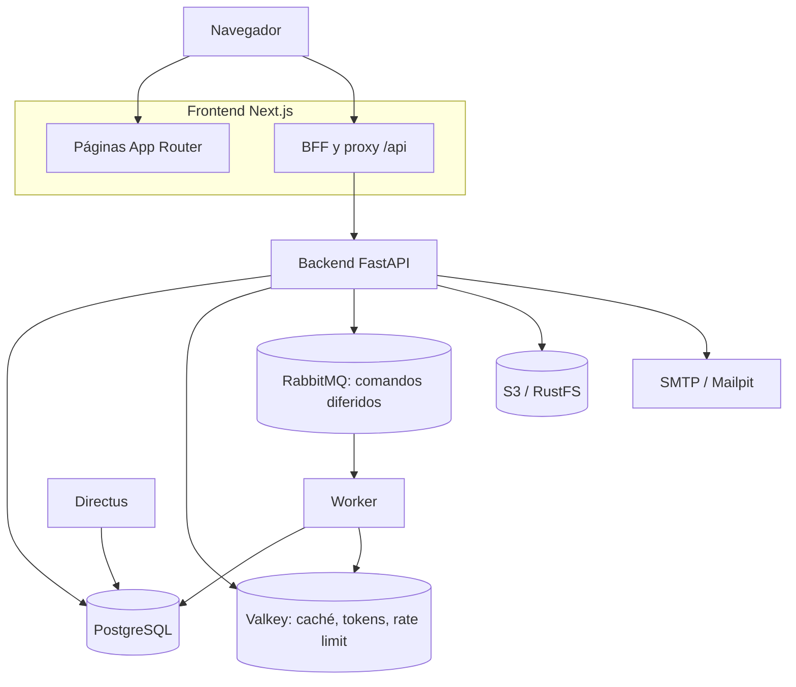
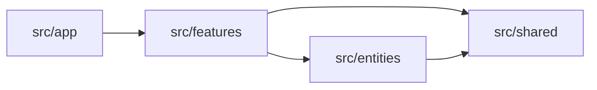

<Callout title="En resumen">
  El navegador solo habla con el frontend Next.js; las llamadas a la API pasan por `/api` en el mismo origen. El backend FastAPI sigue Clean Architecture y es el único que accede a PostgreSQL, Redis y al almacenamiento de objetos.
</Callout>

## Vista de alto nivel

```mermaid
flowchart TB
  browser[Navegador]
  subgraph web[Frontend Next.js]
    pages[Páginas App Router]
    bff[BFF y proxy /api]
  end
  api[Backend FastAPI]
  db[(PostgreSQL)]
  redis[(Valkey: caché, tokens, rate limit)]
  mq[(RabbitMQ: comandos diferidos)]
  worker[Worker]
  s3[(S3 / RustFS)]
  smtp[SMTP / Mailpit]
  directus[Directus]

  browser --> pages
  browser --> bff
  bff --> api
  api --> db
  api --> redis
  api --> mq
  mq --> worker
  worker --> db
  worker --> redis
  api --> s3
  api --> smtp
  directus --> db
```

- **Mismo origen.** El código de navegador llama a `/api` a través de los helpers HTTP compartidos. El proxy de Next reescribe esas rutas al backend y los route handlers BFF gestionan las cookies de sesión. El código de servidor puede llamar al backend directamente.
- **Credenciales en servidor.** Tokens de infraestructura y secretos nunca llegan al cliente.
- **Tenant explícito.** El tenant activo viaja en la cabecera `X-Tenant` y el backend valida la membresía en cada request.

## Backend

Módulos orientados a dominio (`auth`, `users`, `profile`, `tenants`, `messaging`, `assets`, `admin`) sobre un shared kernel `common`. Las dependencias apuntan hacia el dominio. Detalle en [Arquitectura backend](arquitectura-backend.mdx).

## Frontend

Estructura por features con flujo `app -> features -> entities -> shared`, fachadas públicas por slice y rutas delgadas. Detalle en [Arquitectura frontend](arquitectura-frontend.md).

```mermaid
flowchart LR
  app[src/app] --> features[src/features]
  features --> entities[src/entities]
  features --> shared[src/shared]
  entities --> shared
```

## Dominio y datos

- [Dominio](dominio.mdx): tenants, miembros, roles, permisos e invitaciones.
- [Modelo de datos](modelo-de-datos.md): tablas del core y sus relaciones.
