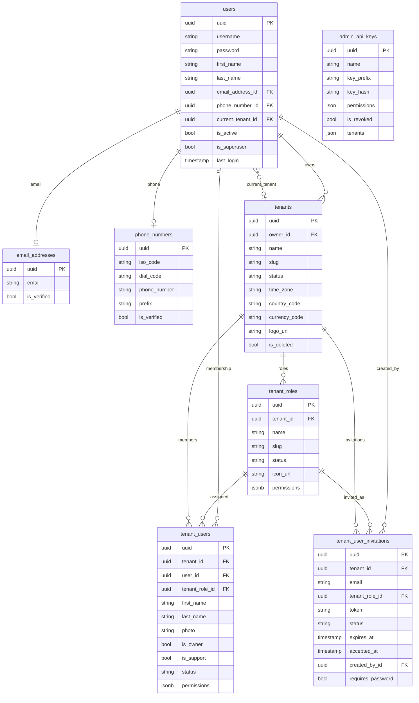

Fuente de verdad: `backend/src/common/database/models/**` y las migraciones de
`backend/src/common/database/versions/`. Todas las tablas heredan `uuid`,
`created_at` y `updated_at` de `UUIDTimestampMixin`; el diagrama omite los
timestamps.

`admin_api_keys` no tiene claves foráneas: `tenants` guarda la lista de tenants a
los que la clave accede (`null` significa todos).
