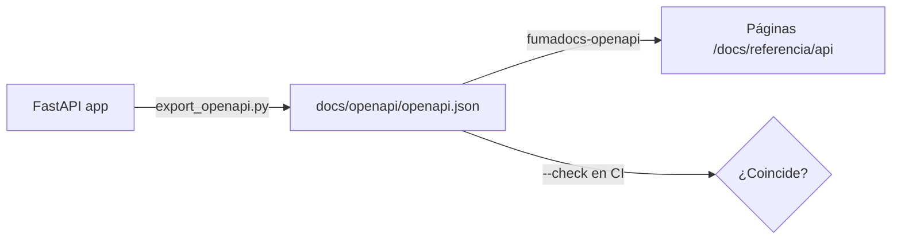

<Callout title="En resumen">
  La [referencia de la API](../../referencia/index.mdx) se genera desde `docs/openapi/openapi.json`, un snapshot exportado de la app FastAPI. Cuando cambia un endpoint, se regenera con `just backend openapi` y se versiona junto al cambio; CI falla si queda desfasado.
</Callout>

## Cómo funciona



- `backend/scripts/export_openapi.py` importa la app sin arrancar servicios ni tocar la base de datos y escribe el esquema.
- El sitio lee el snapshot con `fumadocs-openapi` y crea una página por operación, agrupada por tag, en `/docs/referencia/api`. No hay archivos MDX generados que mantener.
- El job de backend en CI ejecuta el exportador con `--check` y falla si el snapshot no coincide con el código.

## Cuándo regenerar

Siempre que cambie el contrato HTTP: rutas, métodos, parámetros, cuerpos, respuestas, tags, resúmenes o descripciones de endpoints.

## Pasos

<Steps>
  <Step>
    ### Regenerar

    ```bash
    just backend openapi
    ```

    Usa el contenedor `api` sin levantar dependencias. Sin Docker, desde `backend/`: `uv run --locked python scripts/export_openapi.py > ../docs/openapi/openapi.json`.
  </Step>
  <Step>
    ### Revisar el diff

    Comprueba que `git diff docs/openapi/openapi.json` contiene solo los cambios esperados del contrato.
  </Step>
  <Step>
    ### Comprobar

    ```bash
    just backend openapi-check   # el snapshot coincide con el código
    just docs build              # las páginas generadas compilan
    ```
  </Step>
</Steps>

## Mejorar lo que se publica

El texto de cada página sale del propio código: `summary` y `description` de la ruta, los docstrings de los endpoints y los modelos Pydantic. Para mejorar la referencia, edita esas fuentes y regenera; no edites el JSON a mano.

El exportador elimina los tags repetidos que produce registrar el mismo tag en el `APIRouter` y en `include_router`. Las reglas de negocio que el esquema no expresa van en páginas propias, como [Miembros e invitaciones](../../referencia/miembros-e-invitaciones.md).

El skill [openapi-sync](../../../../../.claude/skills/openapi-sync/SKILL.md) automatiza esta guía para agentes.
